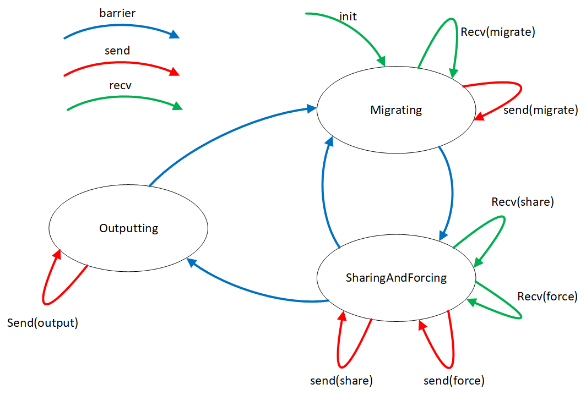
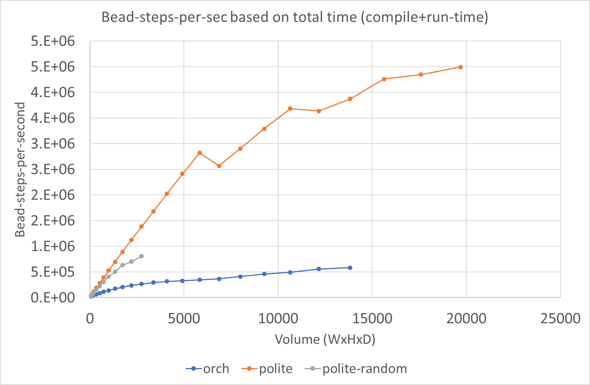
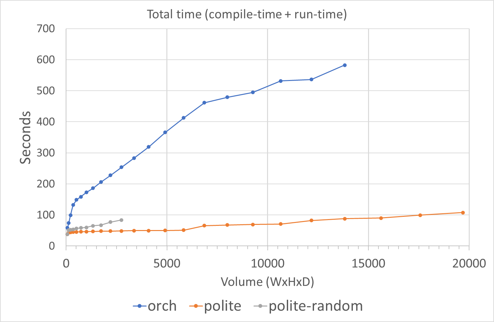
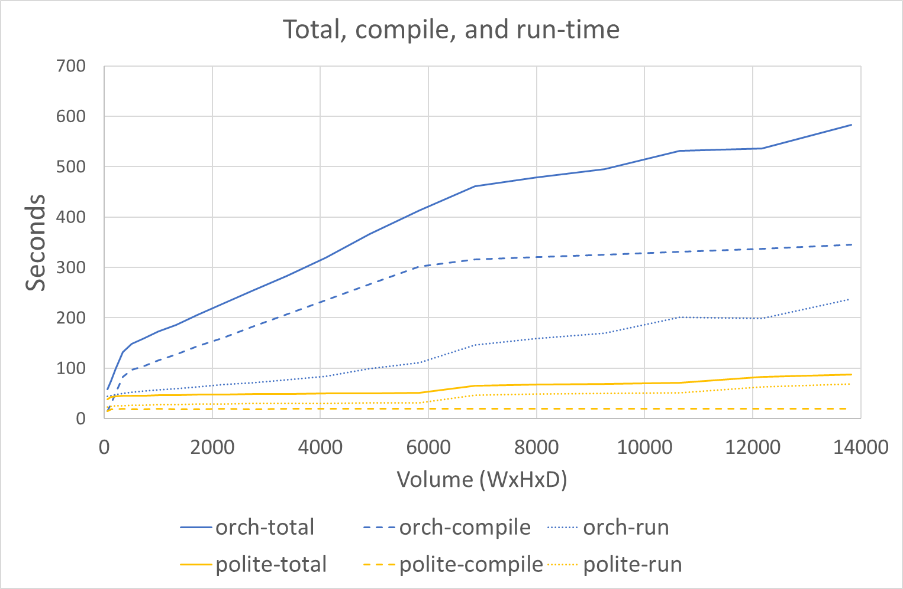
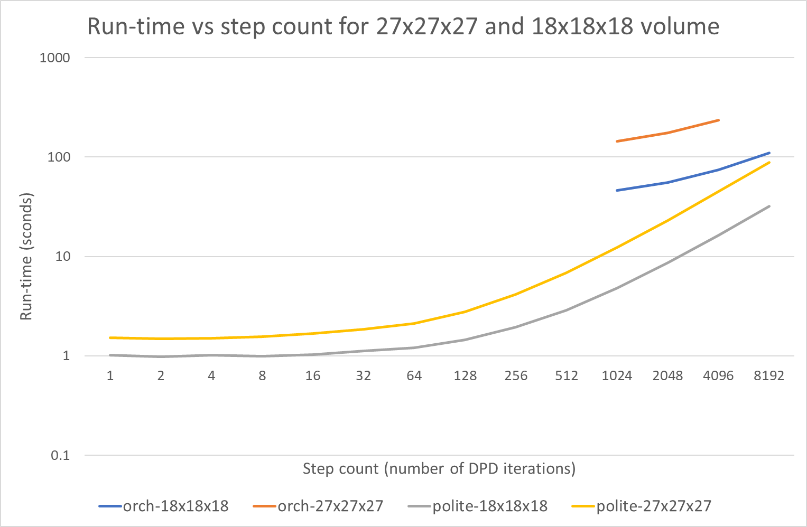

Algorithm
=========

The DPD algorithm used is identical for POLite and XML versions. The
same C++ source files provide the handlers and struct definitions for
both, so everything related to the devices implementing the DPD
algorithm are identical.

DPD Cell algorithm
-------------------

The algorithm has three phases:

1.  Migrating : forces are applied to resident bead set and new positions are worked out
    - Any beads that move outside their boundaries are broadcast to neighbouring cells
    - Any beads received from neighbours are checked, and beads inside cell boundaries are added to resident set
    - Barrier once all migrating beads have been sent and received
        - Always goes to SharingAndForcing
2.  SharingAndForcing: resident beads are shared with neighbouring cells, and forces (DPD and bond) are accumulated
    - A view (id+position+speed) of each resident bead is broadcast to each neighbour
    - Each received bead view is interacted with all resident beads to accumulate force on resident bead
        - All beads : DPD forces are calculated
        - Hookean partners : hookean force is calculated
        - Angle bond centres : view is checked to see if it is one of the partners
            - First partner seen : id+position of partner is stored
            - Second partner seen : angle force is calculated and added to angle force list
        - Any angle forces are broadcast to all neighbours
        - Any received angle forces are checked against resident set
    - Barrier once all views have been sent and received, and all angle forces sent and received
        - If we have hit output interval, then go to Outputting
        - Otherwise go back to Migrating
3.  Outputting : send copy of all resident beads
    - These are pure outputs from the DPD cell point of view, then don't get where they go

The DPD cells form a complete closed system, with no inputs beyond their initial configuration.
The cells are deterministic up to the limits of floating-point associativity occuring due to
non-deterministic message ordering when receiving messages. All random numbers are based on
symmetric hashes which guarantee pair-wise random-numbers are identical, even in the presence
of floating-point rounding errors in position.

Given a WxHxD simulation, we have the following derived parameters:
- `volume = W*H*D`
- `beads = volume*3` : density is fixed at 3 beads per unit volume
- `messages/step = beads * 27 * (1 + pMigrate + 2*pAngle)`, where:
    - `pMigrate` is the probability of a bead migration per time-step.
    - `pAngle` is the probability or fraction of beads which are angle bond centres.

Output and checking
-------------------

The DPD cell devices are designed to output their current beads via
a device every N steps, and here the two versions differ:

- POLite: bead exports are connected to the hostlink address, and read
  back into software.
   - Always : counts the beads and ensures all beads are received
   - Optionally : diffs the output positions against a reference software engine
   - Optionally : diffs the output against Osprey-DPD

- XML : a root device is created, which collects the outputs in one place.
  Currently it performs two checks:
  - Always : counts the beads and forms a check-sum over ids to make sure no beads have been lost.
  - Optionally : if the number of time-steps is small enough (less than ~100), it will choose 16 beads
    of interesting types and check that they end up within a tolerable distance error.

In both cases there is an O(beads) sequential bottleneck, either via the hostlink
or in the collector device. For very short numbers of time-steps this is a noticeable
bottleneck, but it is eventually amortised out for 1000s of steps. There is no particular
reason to think that one is more of a bottleneck then the other, though neither has
been measured.

Verification
------------

Both the POLite and XML versions use exactly the same handler code and types, which
for convenience we will just call BasicV5. There are other variants in poets-dpd,
but this is the "default" version, as others have no inherent advantage. The
BasicV5 handlers are an expression of message-types and handlers which can be
directly executed in software, POLite, and in a POETS engine. It makes no
assumptions about how it is implemented beyond the standard POETS messages + handler
model.

The BasicV5 algorithm and handler code has been tested using the following platforms and methods:

- Software model:
   - Software direct (x86,single-thread) : sequentially executing the handlers with knowledge of what they do
   - Software oblivious (x86,single-thread) : executing the handlers using a message pool that has no idea what they do.
- POLite:
   - Software simulation (x86,single-thread) : agressively OoO simulation using POLite software simulator
   - Hardware execution (tinsel) : direct execution of handlers using (slightly custom) POLite engine
       - Metis placement : default placement method in POLite, based on the old toy_softswitch placer
       - Random placement : random assignment of devices to threads
       - Weighted placement : customised placer which uses per-device bond weights to influence allocation to cells
- XML:
   - graph_schema (x86,single-thread) : standard round based software simulator. No message re-ordering
   - graph_sim (x86,single-thread) : OoO simulator with configurable send policy. Tested with varying
       balances between probability of sending versus receiving, and following strategies:
       - FIFO : newest message is always delivered first
       - LIFO : oldest message is always delivered first
       - Random : pick random message from in-flight pool to deliver
   - POEMS (x86,multi-threaded) : high-performance multi-core simulator
   - Orchestrator (tinsel) : needs no introduction. Approaches tried were:
       - spread (worked fine)
       - tfill (only for tiny graphs)
       - random (compiled for small graphs, but didn't execute)
       - sa (couldn't get it to work)

Experiments
-----------

The main set of experiments were performed using Jennings, so 6 boards. This was for
a few reasons:
- Jennings has twice the instruction memory per core, which is needed for BasicV5 in the orchestrator
- Not wanting to tie up the big system for large periods

There are four main data-points:
- POLite : standard POLite
- POLite-random : POLite degraded to random placement
- Orch : standard Orchestratory using place=spread
- Orch-random : POLite using place=rand

The input system is very boring, and is just a uniformly distributed water with density 3.
AFAIK, the more complex systems are supported fine, but these experiments
were to look at core scaling as we sweep parameters.

The two main parameters changed are:
- Volume : the size of the system (equal to bead count divided by 3)
- Steps : number of DPD time-steps performed

Measured parameters are:
- Compile-time : how long it took to prepare the graph
   - For the orchestrator this is the time to load, tlink, place, and compose
   - For POLite this is the time taken to load, place, and map. For various reasons it includes the hostlink startup time too
- Run-time : time taken to execute the given number of steps and get the output
   - For the orchestrator this is the time till the "SUCCESS" message comes over handler_log
   - For POLite this is the time taken till all beads are read and the new state has been dumped to a file

Derived measurements are:
- `total_time = compile_time + run_time`
- `run_time_bead_steps_per_sec =  beads * steps / run_time`
- `total_time_bead_steps_per_sec =  beads * steps / total_time`

An upper limit of 240 seconds was set on run-time, based on previous experience
of how fast the POLite version was.

Originally an upper limit on compile-time was also set at 240, but this was upped
to 2400 seconds in order to explore further into the Orchestrator results.

Results
=======

Results are available in [orch_scaling-2022-01-04--07-38.csv].

The graphs are all pulled out of a pivot tables, hence the odd formatting.

Note that this was run on Jennings with ~6000 threads, so for a volume
of 6000 and decent placement we would expect more than one device
per thread for volume > 6000.

Bead steps per second, Steps=8192
-----------------------------------------------

This is the headline performance, as it is around the "useful" number
of steps per second between DPD snap-shots and the IO/setup is mostly
amortised out.

We see that POLite has near perfect scaling up till ~6000, as that
is the point at which there is more than one device per thread. After
a brief drop in performance it continues to improve, I think mostly
as it is starting to use up the slack between hardware idles.

As a reference point, the eventual point of about 5e6 beads-steps-per-second
would compare with ~30e6 for the Julian-scale hardware stuff we did.

The POLite-random time drops off, then at around volume=2500 it no
longer compiles. This is because there are so many inter-FPGA edges
that it exhausts the SRAM available for edge info. It could be continued
by pushing edges onto DRAM, but there doesn't seem much point. There
is clearly a massive benefit from clustering and placement. I could
have tried doing it with Scotch, but didn't bother due to children
wanting to do Lego.

The Orchestrator has a scaling curve that rolls off much faster. There
is an inflection point at volume=6000, which I think is due to a combination
of the compilation burden reducing, combined with the latency hiding
that comes from the over-subscription. I would assume that with better
placement it would have a better scaling curve, but I was unable to
get SA to work.

The dual of bead-steps-per-second is run-time, though it is less useful
here as you have to reconise the amount of work done is changing with the volume:

Compilation time
----------------

The total time is not the full story, as for POLite the compile-time
is almost constant, while for the Orchestrator it actually dominates
run-time.

For POLite the compile-time is close to constant, which is because it is dominated
by the hostlink acquisition time of around 15 seconds.

For the orchestrator we see two main regimes (ignoring very small graphs):
- 200..6000 : the number of executable files is increasing, so number of compilation jobs is increasing
- 6000..140000 : fixed number of executable files, but each object file is getting bigger.

Run-time
--------

Looking just at run-time (ignoring compile time), we get the following
execution times for volumes of 18x18x18 and 27x27x27:

For smaller numbers of steps there is some kind of hanging problem in the
Orchestrator - the graph just hangs. However, if there is enough work to
do then it seems to complete as expected.

Conclusions and notes
=====================

- The orchestrator hardware idle stuff seems to work just fine - nicely done Graeme.
- I suspect that the spread placement is hurting run-time performance quite a lot, and
  probably the sa method will drop run-time closer to POLite.
- Compilation time is a problem
    - When testing applications it can be a blocking factor, even with a small graph
    - When benchmarking it reduces the number of experiments that can be performed
    - For real-world use it might be ok, but only if the graph run-time is an hour or more
- There seems to be some kind of startup issue with this graph, such that fast graphs don't complete
   - No idea what it might be
